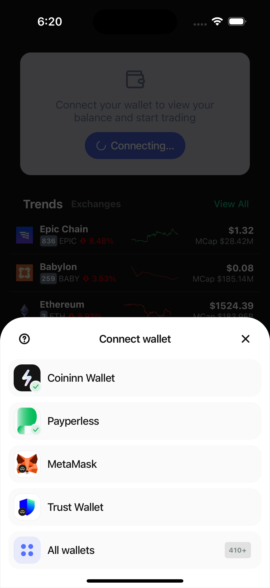
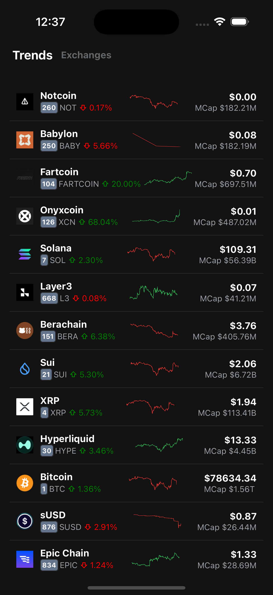
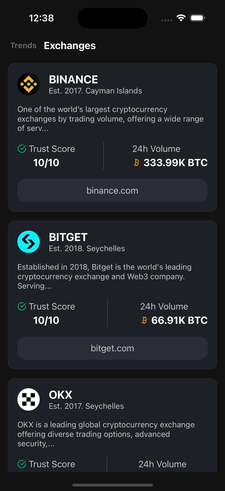
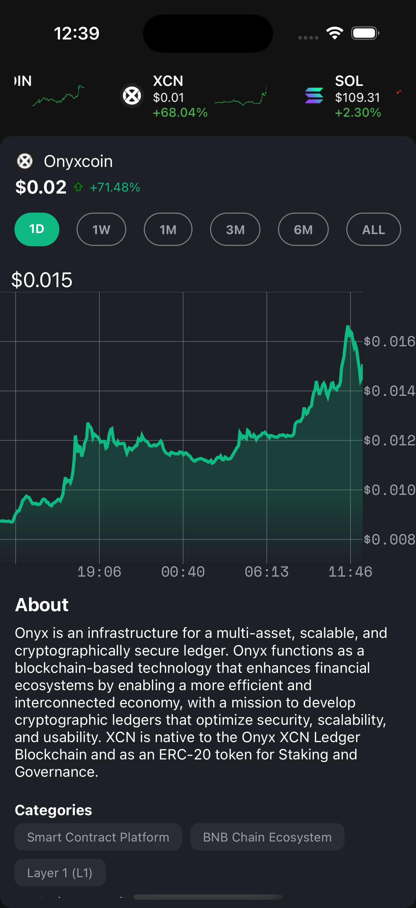

# Crypto Pulse

A modern cryptocurrency tracking application built with React Native and Tamagui, providing real-time insights into cryptocurrency markets, exchanges, and price movements.

## Features

- **Real-time Price Tracking**: Monitor cryptocurrency prices with live updates
- **Exchange Information**: Detailed view of cryptocurrency exchanges with trust scores and trading volumes
- **Price Charts**: Interactive price charts with historical data
- **Modern UI**: Clean, responsive interface built with Tamagui
- **Performance Optimized**: Smooth animations and efficient data handling

## Screenshots

<div align="center">
  
  
  
  
</div>

## Tech Stack

- **Frontend**: React Native Expo
- **UI Framework**: Tamagui
- **API State Management**: React Query
- **Charts**: victory-native
- **API**: CoinGecko API

## Getting Started

### Prerequisites

- Node.js (v14 or higher)
- npm or yarn
- React Native development environment setup

### Installation

1. Clone the repository:
```bash
git clone https://github.com/ugbechike/crypto_pulse.git
cd crypto_pulse
```

2. Install dependencies:
```bash
npm install
# or
yarn install
```

3. Start the development server:
```bash
npm start
# or
yarn start
```

## Project Structure

```
crypto-pulse/
├── components/         # Reusable UI components
├── hooks/             # Custom React hooks
├── utils/             # Utility functions
├── types/             # TypeScript type definitions
└── assets/            # Static assets
```

## Key Components

- **PriceChart**: Interactive price charts with real-time data
- **Exchanges**: List of cryptocurrency exchanges with detailed information
- **CoinDetails**: Comprehensive view of individual cryptocurrencies
- **SkeletonLoader**: Animated loading states

## Contributing

Contributions are welcome! Please feel free to submit a Pull Request.

## License

This project is licensed under the MIT License - see the LICENSE file for details.

## Acknowledgments

- CoinGecko API for providing cryptocurrency data
- Tamagui team for the excellent UI framework
- React Native Expo community for their continuous support